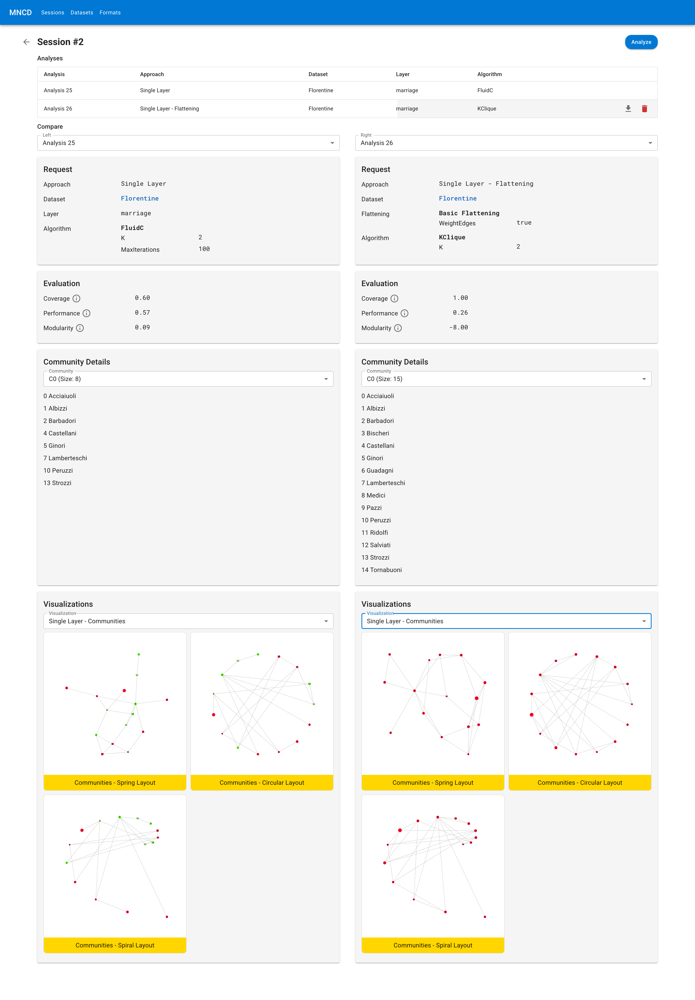

# MNCD APP



Web application used for analysis of communities in multi layer networks,
written in dotnet core and react. Algorithms for community detection are used
from the [mncd](https://www.github.com/matejkubinec/mncd) library.

## Requirements

- [.NET 9 SDK](https://dotnet.microsoft.com/en-us/download/dotnet/9.0)
- [Node LTS](https://nodejs.org/en/download)

## Running

1. Install packages

```sh
make fe-dep
```

2. Run frontend

```sh
make fe-dev
```

3. Run backend (In another terminal)

```sh
make be-dev
```

### Docker

You can use the `ghcr.io/matejkubinec/mncd-app:edge` to setup the app or use the compose file below:

```yaml
services:
  mncd-app:
    container_name: mncd-app
    image: ghcr.io/matejkubinec/mncd-app:edge
    ports:
      - 8080:8080
    environment:
      - MNCD_VISUALIZATION_URL=http://mncd-viz:5050

  mncd-viz:
    container_name: mncd-viz
    image: ghcr.io/matejkubinec/mncd-viz:edge
    restart: unless-stopped
    ports:
      - 5050:5050
```
