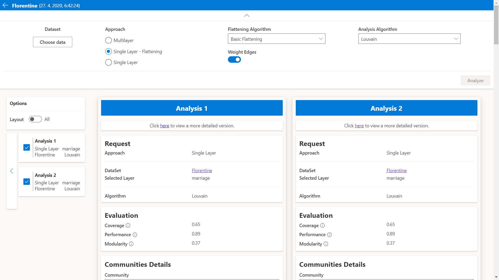

# MNCD APP



Web application used for analysis of communities in multi layer networks,
written in dotnet core and react. Algorithms for community detection are used
from the [mncd](https://www.github.com/matejkubinec/mncd) library.

## Requirements

- [.NET 7 SDK](https://dotnet.microsoft.com/en-us/download/dotnet/7.0)
- [Node LTS](https://nodejs.org/en/download)

## Running

1. Install npm packages

```sh
# Move to client app folder
cd src/MNCD.Web/UI

# Install packages
npm install
```

2. Run the dotnet core app
```sh
# Move to web directory
cd src/MNCD.Web

# Run the app
dotnet run
```
